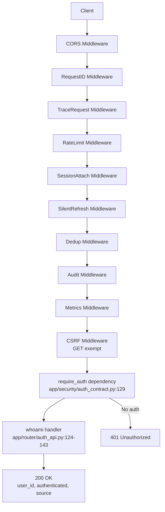
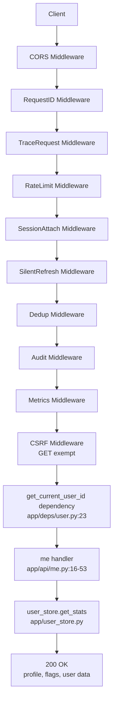

# GesahniV2 Identity Resolution Audit

## Executive Summary

This audit examines the identity resolution system in GesahniV2, focusing on the `/v1/whoami` and `/v1/me` endpoints. The system implements a multi-layered authentication approach with JWT tokens, session cookies, and comprehensive middleware protection.

## Endpoints Summary

| Endpoint | Method | Handler | Authentication | Response Format |
|----------|--------|---------|----------------|-----------------|
| `/v1/whoami` | GET | `app.router.auth_api:whoami` | Required | `{"user_id": string, "authenticated": boolean, "source": string}` |
| `/v1/me` | GET | `app.api.me:me` | Optional | Complex profile object with user stats and feature flags |

## Data Flow Diagrams

### /v1/whoami Flow


### /v1/me Flow


## Dependency Chain Analysis

### Middleware Stack Order
1. **CORSMiddleware** - Handles CORS preflight and headers
2. **RequestIDMiddleware** - Adds unique request ID for tracing
3. **TraceRequestMiddleware** - Adds tracing headers for observability
4. **RateLimitMiddleware** - IP-based rate limiting (configurable)
5. **SessionAttachMiddleware** - Attaches session data to request state
6. **SilentRefreshMiddleware** - Handles automatic token refresh
7. **DedupMiddleware** - Prevents duplicate request processing
8. **AuditMiddleware** - Logs security events to audit trail
9. **MetricsMiddleware** - Collects request metrics
10. **CSRFMiddleware** - CSRF protection (GET requests exempt)

### Handler Dependencies

#### /v1/whoami
- **require_auth** (`app/security/auth_contract.py:114-142`) - Requires authenticated identity
  - Returns 401 for no valid auth
  - Validates JWT tokens and session cookies

#### /v1/me
- **get_current_user_id** (`app/deps/user.py:22-416`) - Extracts user identity
  - Supports multiple token sources (Bearer, cookies, sessions)
  - Falls back to "anon" for unauthenticated requests

## Response Shapes

### /v1/whoami (200 OK)
```json
{
  "user_id": "user123",
  "authenticated": true,
  "source": "cookie"
}
```

### /v1/me (200 OK)
```json
{
  "is_authenticated": true,
  "session_ready": true,
  "user_id": "user123",
  "user": {
    "id": "user123",
    "email": null
  },
  "source": "cookie",
  "version": 1,
  "profile": {
    "user_id": "user123",
    "login_count": 5,
    "last_login": "2024-01-15T10:30:00Z",
    "request_count": 150
  },
  "flags": {
    "retrieval_pipeline": false,
    "use_hosted_rerank": false,
    "debug_model_routing": false,
    "ablation_flags": [],
    "trace_sample_rate": 0.1
  }
}
```

## Authentication Rules

### Token Resolution Priority
1. **Authorization: Bearer `<token>`** - Highest priority
2. **access_token cookie** (`gsn_access`) - Browser sessions
3. **WebSocket query param** (`access_token`) - Real-time connections
4. **Session cookie** (`__session`) - Opaque session ID resolution
5. **Fallback to anonymous** - No authentication provided

### JWT Validation
- **Algorithm**: HS256
- **Required claims**: `user_id` or `sub`
- **Optional claims**: `scope`, `scopes`, `iss`, `aud`, `exp`
- **Clock skew tolerance**: 60 seconds
- **Secret source**: `JWT_SECRET` environment variable

### Session Resolution
- **Session store**: Redis (preferred) or in-memory fallback
- **Identity mapping**: Session ID → JWT payload
- **Legacy support**: JTI mapping for backward compatibility

## CSRF Protection

### GET Requests
- **Status**: Exempt (always allowed)
- **Behavior**: Sets `csrf_token` cookie and returns `X-CSRF-Token` header

### State-Changing Requests (POST/PUT/PATCH/DELETE)
- **Required**: `X-CSRF-Token` header matching `csrf_token` cookie
- **Bypass conditions**:
  - Bearer authentication without session cookie
  - OAuth callback endpoints (`/v1/auth/*/callback`)
  - Webhook endpoints with signature verification (`/v1/ha/webhook`)

## Auth Status Code Matrix

| Scenario | /v1/whoami | /v1/me | Notes |
|----------|------------|--------|-------|
| No auth cookies/headers | 401 | 200 | /me allows anonymous, returns `is_authenticated: false` |
| Valid access cookie | 200 | 200 | Both endpoints work with valid auth |
| Invalid/expired cookie | 401 | 200 | /whoami requires valid auth, /me allows expired |
| Bearer token valid | 200 | 200 | Both support Bearer authentication |
| Bearer token invalid | 401 | 200 | /whoami validates tokens, /me doesn't check validity |
| Rate limit exceeded | 429 | 429 | Both subject to rate limiting |
| CSRF missing (GET) | N/A | N/A | GET requests exempt from CSRF |
| CSRF missing (POST) | N/A | N/A | POST not supported on these endpoints |

## Edge Cases & Error Handling

### Anonymous Access
- **/v1/whoami**: Returns 401 for any unauthenticated request
- **/v1/me**: Allows anonymous access, returns `user_id: null`, `is_authenticated: false`

### Token Expiration
- **Access tokens**: Handled by JWT `exp` claim validation
- **Refresh tokens**: Automatic refresh via `SilentRefreshMiddleware`
- **Session tokens**: Resolved via session store with TTL

### Invalid Tokens
- **JWT decode failures**: Logged and treated as unauthenticated
- **Malformed tokens**: 401 response with error logging
- **Wrong issuer/audience**: Configurable validation via env vars

### Session Store Outages
- **Fallback behavior**: 503 when session store unavailable and session cookie present
- **Graceful degradation**: Anonymous access when session resolution fails
- **Metrics**: `AUTH_STORE_OUTAGE` counter for monitoring

## Performance & Latency Risks

### Blocking Operations
- **Database calls**: `user_store.get_stats()` in /v1/me handler
- **Session store**: Redis calls for session resolution (async where possible)
- **JWT decoding**: Synchronous cryptographic operations

### Caching Opportunities
- **User stats**: Could be cached with short TTL
- **JWT validation**: Could cache valid tokens
- **Session resolution**: Already cached in session store

### Middleware Overhead
- **Rate limiting**: Redis calls for distributed rate limiting
- **Audit logging**: File/database writes for security events
- **Metrics collection**: Prometheus metric updates

## Database & External Calls

### Database Operations
- **User stats**: `app.user_store.get_stats(user_id)` - Fetches login count, last login, request count
- **Session lookup**: `app.session_store.get_session_identity(token)` - Resolves session to user identity
- **Audit logging**: Security events written to audit trail

### External Dependencies
- **Redis**: Session storage and rate limiting (optional)
- **None**: No external HTTP calls in identity endpoints

## Security Considerations

### Authentication Strength
- **JWT secrets**: Must be >=32 characters in production
- **Session isolation**: Opaque session IDs prevent token exposure
- **Clock skew**: 60-second tolerance for time synchronization

### CSRF Protection
- **Double-submit pattern**: Header + cookie validation
- **Bypass controls**: Limited to specific authenticated scenarios
- **Legacy support**: Graceful migration path for old headers

### Audit Trail
- **Request logging**: All auth attempts logged with user ID
- **Security events**: CSRF violations, invalid tokens tracked
- **Metrics**: Authentication success/failure rates monitored

## Configuration Dependencies

### Environment Variables
- `JWT_SECRET`: Required for token validation
- `JWT_ISSUER`/`JWT_AUDIENCE`: Optional JWT claim validation
- `CSRF_ENABLED`: Controls CSRF protection (default: disabled)
- `RATE_LIMIT_ENABLED`: Controls rate limiting (default: enabled)
- `REDIS_URL`: Session store backend

### Feature Flags
- `REQUIRE_JWT`: Forces JWT requirement even in development
- `JWT_OPTIONAL_IN_TESTS`: Allows anonymous access in test environments
- `CSRF_LEGACY_GRACE`: Enables legacy CSRF header support

## Gaps & Recommendations

### Missing Features
1. **Token refresh endpoint**: No dedicated `/refresh` endpoint documented
2. **Scope validation**: Basic scope checking exists but not used in these endpoints
3. **MFA support**: No multi-factor authentication implemented
4. **Device tracking**: Basic device ID support but not fully utilized

### Security Enhancements
1. **JWT rotation**: Implement automatic token rotation
2. **Brute force protection**: Add login attempt rate limiting
3. **Session management**: Add session invalidation controls
4. **Audit improvements**: Enhanced audit trail with more context

### Performance Optimizations
1. **Response caching**: Cache user stats with appropriate TTL
2. **Async database calls**: Ensure all DB operations are properly async
3. **Connection pooling**: Optimize database connection usage
4. **Metrics optimization**: Reduce overhead of metrics collection

## Conclusion

The GesahniV2 identity system provides robust authentication with comprehensive middleware protection, but has some areas for improvement in performance optimization and feature completeness. The current implementation balances security with usability while maintaining backward compatibility.
