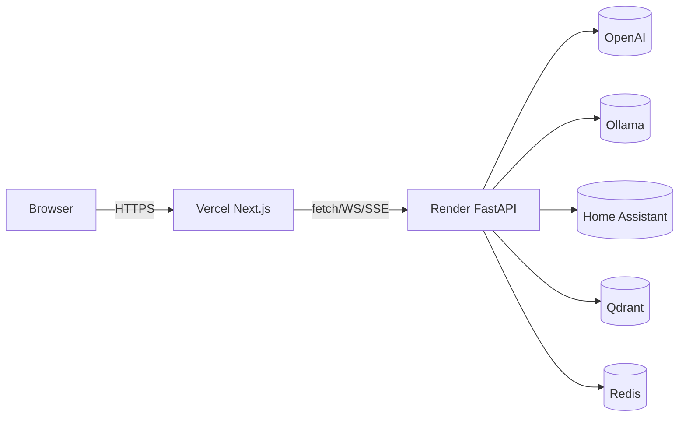
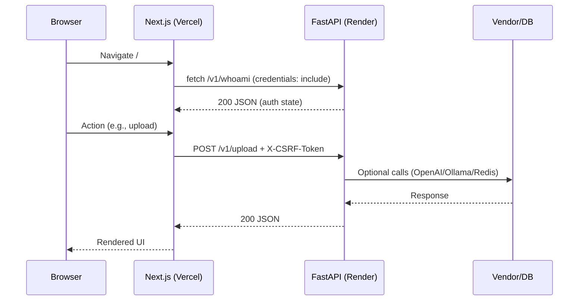
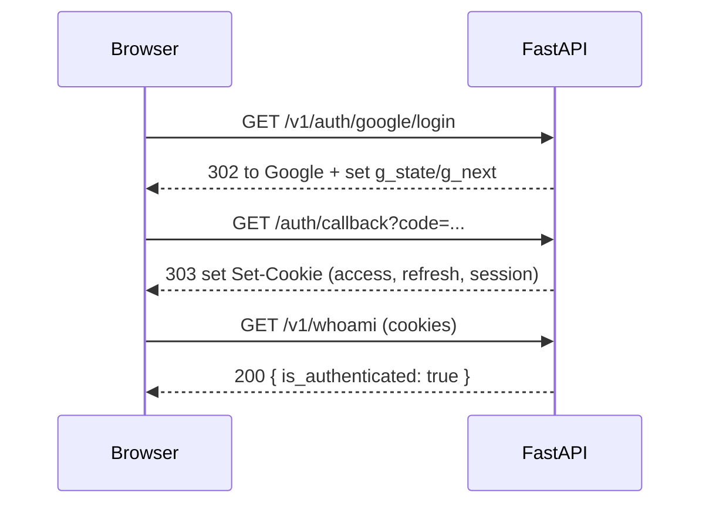
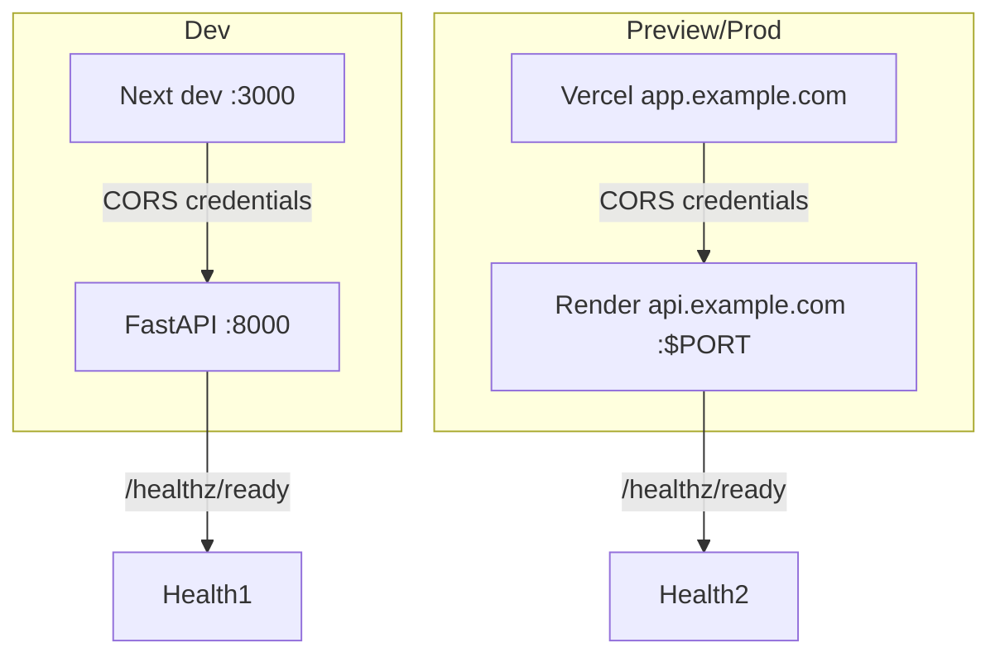

# Diagrams

## Module/Service Graph

```mermaid
graph LR
  Browser -->|HTTPS| Next[Vercel Next.js]
  Next -->|fetch/WS/SSE| API[Render FastAPI]
  API --> OpenAI[(OpenAI)]
  API --> Ollama[(Ollama)]
  API --> HA[(Home Assistant)]
  API --> Qdrant[(Qdrant)]
  API --> Redis[(Redis)]
```

## Request Flow

```mermaid
sequenceDiagram
  participant B as Browser
  participant N as Next.js (Vercel)
  participant A as FastAPI (Render)
  participant V as Vendor/DB
  B->>N: Navigate /
  N->>A: fetch /v1/whoami (credentials: include)
  A-->>N: 200 JSON (auth state)
  B->>N: Action (e.g., upload)
  N->>A: POST /v1/upload + X-CSRF-Token
  A->>V: Optional calls (OpenAI/Ollama/Redis)
  V-->>A: Response
  A-->>N: 200 JSON
  N-->>B: Rendered UI
```

## Auth Sequence (Cookie)

```mermaid
sequenceDiagram
  participant B as Browser
  participant A as FastAPI
  B->>A: GET /v1/auth/google/login
  A-->>B: 302 to Google + set g_state/g_next
  B->>A: GET /auth/callback?code=...
  A-->>B: 303 set Set-Cookie (access, refresh, session)
  B->>A: GET /v1/whoami (cookies)
  A-->>B: 200 { is_authenticated: true }
```

## Port and URL Map

```mermaid
flowchart TB
  subgraph Dev
    N1[Next dev :3000]
    A1[FastAPI :8000]
  end
  subgraph Preview/Prod
    N2[Vercel app.example.com]
    A2[Render api.example.com :$PORT]
  end
  N1 -->|CORS credentials| A1
  N2 -->|CORS credentials| A2
  A1 -->|/healthz/ready| Health1
  A2 -->|/healthz/ready| Health2
```
